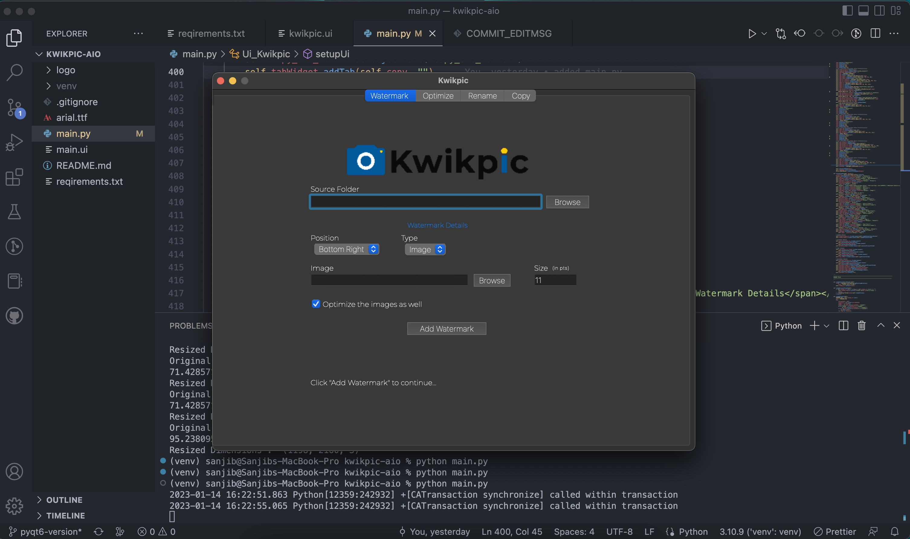

# Kwikpic All In One

## Instruction

```bash
python3 -m venv ven && pip install -r requirements.txt && python3 main.py
```

## Screenshot



## BUILD

### Windows

```ps
pyinstaller --onefile --name Kwikpic --noconsole --clean --icon="icon.ico" --add-data "logo/logo.png:."  main.py --paths="venv\Lib\site-packages\cv2"
```

### Mac

```sh
pyinstaller --noconsole --name Kwikpic --windowed --clean --onedir --add-data "logo/logo.png:." --icon icon.ico main.py
```
